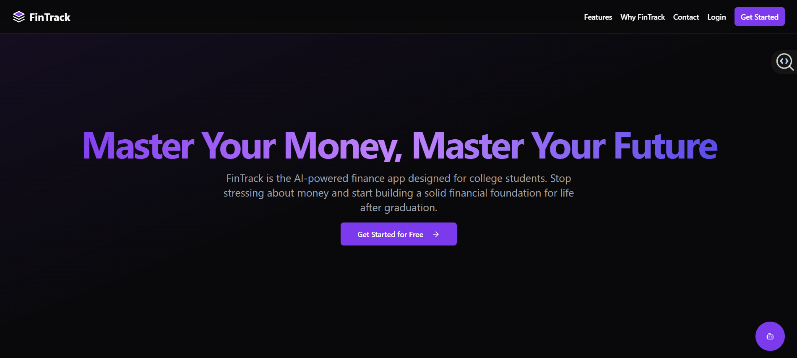
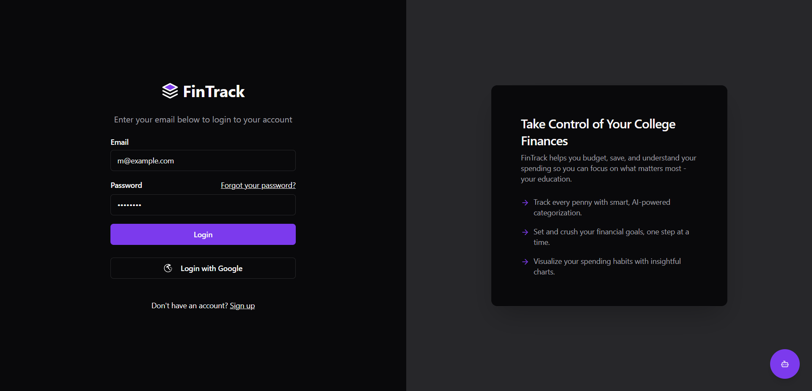

# 💸 FinTrack: AI-Powered Personal Finance for Students

<p align="center">
  
  
  
</p>

<p align="center">
  <strong>Take control of your college finances.</strong> FinTrack is a smart, intuitive, and AI-driven personal finance application designed specifically to help college students budget, save, and understand their spending habits so they can focus on what matters most—their education.
</p>

<p align="center">
  
  
  
  
  
</p>

---

## ✨ Key Features

FinTrack is packed with intelligent features to make financial management seamless and insightful.

- **📊 Interactive Dashboard**: Get a quick overview of your income, expenses, net savings, and goal progress in one place.
- **💸 Smart Transaction Management**: Easily add, edit, and delete transactions. Our system clearly distinguishes between income and expenses.
- **🤖 AI-Powered Smart Import**: Automatically extract and categorize transactions from any document—PDFs, CSVs, or even screenshots of bank statements from services like Google Pay or Paytm.
- **🎯 Dynamic Budgeting**: Set monthly budgets for various spending categories (Food, Utilities, etc.) and visually track your progress to avoid overspending.
- **🌱 Multi-Goal Savings Planner**: Create multiple financial goals, from saving for a new laptop to planning a spring break trip.
- **🧠 AI Smart Allocation**: Let our AI financial advisor intelligently suggest how to allocate your monthly savings across your different goals to help you reach them faster.
- **💡 AI Investment Advisor**: Get personalized investment advice based on your savings, with suggestions for stocks and easy-to-understand explanations.
- **🏆 Achievements & Gamification**: Stay motivated by unlocking achievements and earning medals for building positive financial habits and maintaining daily login streaks.
- **🔄 Recurring Transactions**: Manage your regular bills and subscriptions with ease. FinTrack automatically logs them for you on their due dates.
- **🔒 Secure Authentication**: Robust and secure user login and registration with both email/password and Google Sign-In, including a "Forgot Password" feature.
- **💬 AI Help Assistant**: Have a question? Our friendly AI chatbot is available to provide instant help and answers about the application.

## 🌊 User Flow — with Flowing Money (GitHub-safe Mermaid)

Here’s a cleaned-up, GitHub-compatible version. It “simulates” motion by passing multiple 💵 tokens through the loop (no animation in Markdown, but the repeated tokens convey flow).

```mermaid
flowchart TD

%% =========================
%% USER ONBOARDING
%% =========================
  subgraph Onboarding["🚪 User Onboarding"]
    direction LR
    A([Start]) --> B[Visit FinTrack]
    B --> C{Login or Register?}
    C -- "New User" --> D[Register Page]
    C -- "Existing User" --> E[Login Page]
    E -- "Forgot?" --> Pw[Forgot Password?]
    Pw -.-> E
    D --> F((🏠 Dashboard))
    E --> F
  end

%% =========================
%% CORE EXPERIENCE
%% =========================
  subgraph Core["📱 Core App Experience"]
    direction LR
    F --> G[💸 Transactions]
    F --> H[🎯 Budgets]
    F --> I[🌱 Goals]
    F --> J[🏆 Achievements]
    F --> K[💡 AI Advisor]
  end

%% =========================
%% MONEY & DATA FLOW
%% =========================
  subgraph Data["💾 Money & Data Flow"]
    direction LR
    G -- "Add/Edit" --> T1[Manual Entry]
    G -- "Import" --> T2[Smart Import]
    T1 --> TX_DB[(🗄️ Transactions DB)]
    T2 --> TX_DB

    TX_DB -- "Calculate Net Savings" --> S{Σ Net Savings}
    I -- "Set Allocations" --> S
    S -- "Distribute %" --> I

    H --> TX_DB
    I --> TX_DB
    K --> TX_DB
  end

%% =========================
%% AI-POWERED ACTIONS
%% =========================
  subgraph AIFeatures["🧠 AI-Powered Actions"]
    direction LR
    T2 -- "Analyze Document" --> AI1["🤖 Extract Transactions"]
    I  -- "Smart Allocate" --> AI2["🤖 Suggest Allocations"]
    K  -- "Request Advice" --> AI3["🤖 Investment Advice"]
    F  -- "Health Check" --> AI4["🤖 Analyze Finances"]
    AI1 -.-> Gemini["Google AI (Gemini)"]
    AI2 -.-> Gemini
    AI3 -.-> Gemini
    AI4 -.-> Gemini
  end

%% =========================
%% 💸 FLOWING CASH STREAM (motion-like)
%% =========================
  %% Repeated money tokens looping through the core stages
  M1(((💵))) --> G
  G --> M2(((💵)))
  M2 --> TX_DB
  TX_DB --> M3(((💵)))
  M3 --> H
  H --> M4(((💵)))
  M4 --> I
  I --> M5(((💵)))
  M5 --> K
  K --> M6(((💵)))
  M6 --> F
  F --> M7(((💵)))
  M7 --> G

%% =========================
%% CLASS STYLES (kept simple for GitHub compatibility)
%% =========================
  classDef core fill:#e0f2fe,stroke:#0284c7,stroke-width:2px,color:#0b365a;
  class F,G,H,I,J,K core;

  classDef auth fill:#e0e7ff,stroke:#4338ca,stroke-width:2px,color:#1f2a80;
  class A,B,C,D,E,Pw auth;

  classDef money fill:#dcfce7,stroke:#16a34a,stroke-width:2px,color:#0b3d1f;
  class T1,T2,TX_DB,S money;

  classDef ai fill:#fffbe6,stroke:#f59e0b,stroke-width:2px,color:#7a4b00;
  class AI1,AI2,AI3,AI4,Gemini ai;

  classDef token fill:#ecfdf5,stroke:#10b981,stroke-width:2px,color:#065f46;
  class M1,M2,M3,M4,M5,M6,M7 token;


```



## 🛠️ Tech Stack

FinTrack is built with a modern, powerful, and scalable tech stack.

- **Frontend**:
  - [**Next.js**](https://nextjs.org/) (with App Router)
  - [**React**](https://react.dev/)
  - [**TypeScript**](https://www.typescriptlang.org/)
  - [**Tailwind CSS**](https://tailwindcss.com/)
  - [**ShadCN/UI**](https://ui.shadcn.com/) for beautiful, accessible components.
- **Backend & Database**:
  - [**Firebase**](https://firebase.google.com/) for secure authentication and real-time data storage with Firestore.
- **Artificial Intelligence**:
  - [**Genkit**](https://firebase.google.com/docs/genkit) for orchestrating AI flows.
  - [**Google AI (Gemini)**](https://ai.google/) for powering all intelligent features, from transaction extraction to financial advice.

## 🚀 Getting Started

To get a local copy up and running, follow these simple steps.

### Prerequisites

- Node.js (v18 or newer recommended)
- npm or yarn

### Installation

1. **Clone the repository:**
   ```sh
   git clone https://github.com/your-username/fintrack.git
   cd fintrack
   ```

2. **Install NPM packages:**
   ```sh
   npm install
   ```

3. **Set up Firebase:**
   - Create a project on the [Firebase Console](https://console.firebase.google.com/).
   - Add a new Web App to your project.
   - Copy the `firebaseConfig` object into a new `.env.local` file in your project root. Your file should look like this:
     ```env
     NEXT_PUBLIC_FIREBASE_API_KEY=your-api-key
     NEXT_PUBLIC_FIREBASE_AUTH_DOMAIN=your-auth-domain
     NEXT_PUBLIC_FIREBASE_PROJECT_ID=your-project-id
     NEXT_PUBLIC_FIREBASE_STORAGE_BUCKET=your-storage-bucket
     NEXT_PUBLIC_FIREBASE_MESSAGING_SENDER_ID=your-messaging-sender-id
     NEXT_PUBLIC_FIREBASE_APP_ID=your-app-id
     ```
   - In the Firebase Console, go to **Authentication** -> **Sign-in method** and enable the **Email/Password** and **Google** providers.
   - Go to **Firestore Database** and create a new database in production mode.

4. **Run the development server:**
   ```sh
   npm run dev
   ```

Open [http://localhost:3000](http://localhost:3000) with your browser to see the result.

## ☁️ Deployment

This application is configured for easy deployment with [**Firebase App Hosting**](https://firebase.google.com/docs/app-hosting). Connect your repository and deploy with just a few clicks.

## 📜 License

Distributed under the MIT License. See `LICENSE` for more information.
